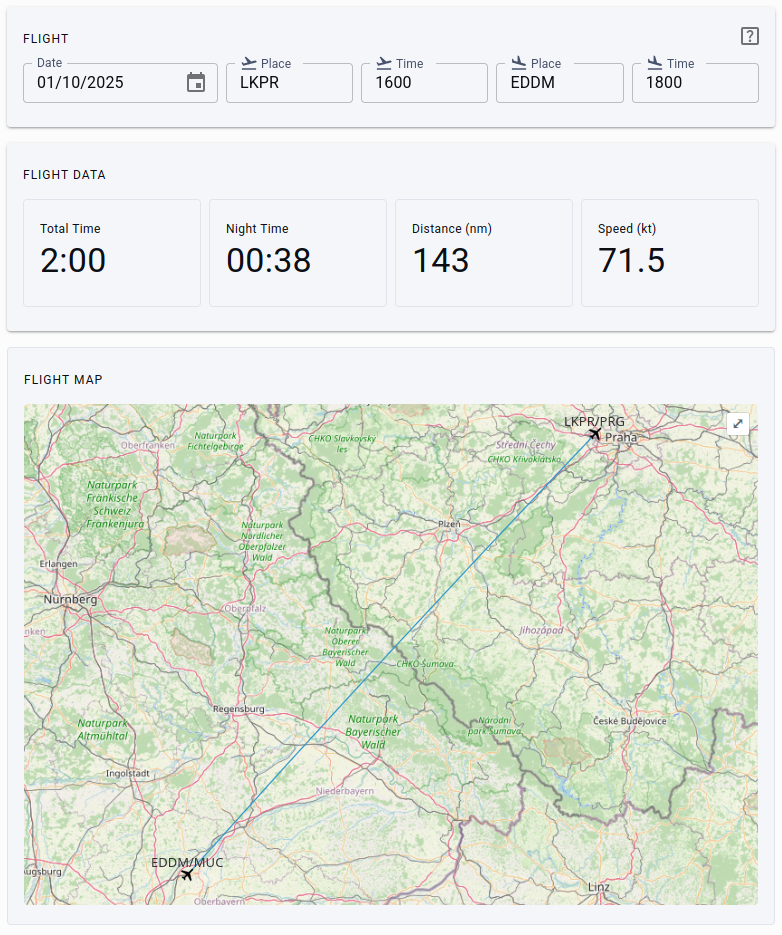

# Flight by Flaps & Throttles

You can use this tool to calculate total flight time and night time for your flight.



## Usage

Just open https://flight.flaps-and-throttles.com and use it.

You also can use a docker:

```bash
docker pull vsimakhin/flight:latest
docker run --rm -it -p 4000:4000 vsimakhin/flight:latest
```
Then you can open it in your browser http://localhost:4000

## Changelog

## [v0.0.3] - 01.10.2025

- First public release

The full changelog is [here](https://github.com/vsimakhin/flight/blob/main/CHANGELOG.md)

## Airport DB

The main airport database source is https://github.com/mwgg/Airports

The file `airport.json` has to be converted (to reduce the size and make it in more convinient format) with a follow script
```bash
jq -c 'to_entries | map({icao: .key} + .value)' airports.json > app/db/airports.json
```

## Related Projects

📖 Check out the [EASA logbook project](https://github.com/vsimakhin/web-logbook).